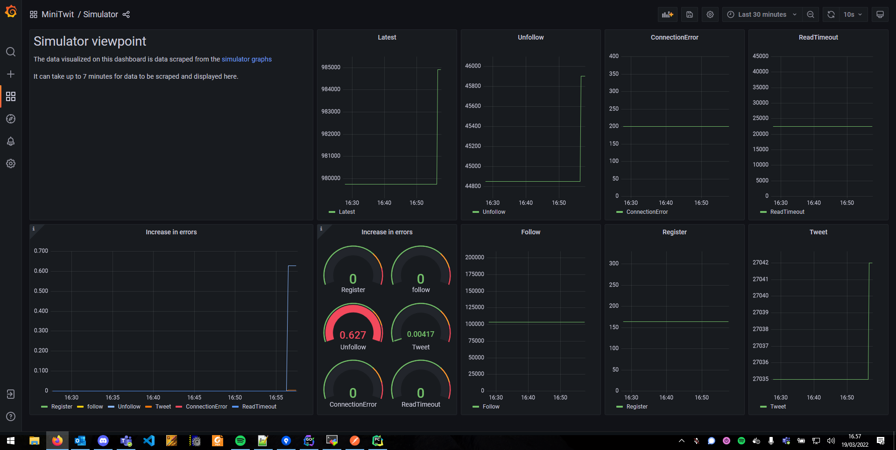

# DataScraper

The purpose of this application is to scrape the information of current error status from http://164.92.246.227/status.html
where the two graphs exists 

These graphs shows what the simulator sees and this data would be nice to track and see if we have an error, or we introduce a new error.

The idea is to make a prometheus /metrics endpoint that with this data could be visualized.

Current exported values are:
- group_d_latest
- group_d_register
- group_d_tweet
- group_d_follow
- group_d_unfollow
- group_d_read_timeout
- group_d_connection_error

The dashboard can be found here: [Dashboad](./Simulator.json)

It has only been tested it very little. The dashboard could use a bit more work. Maybe a simple test application/mock data could help.

